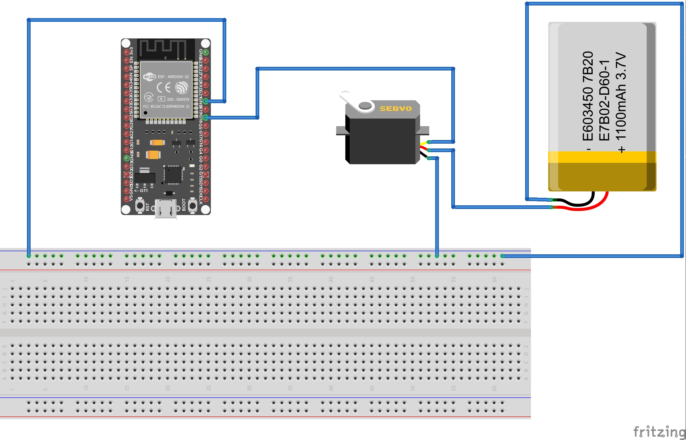
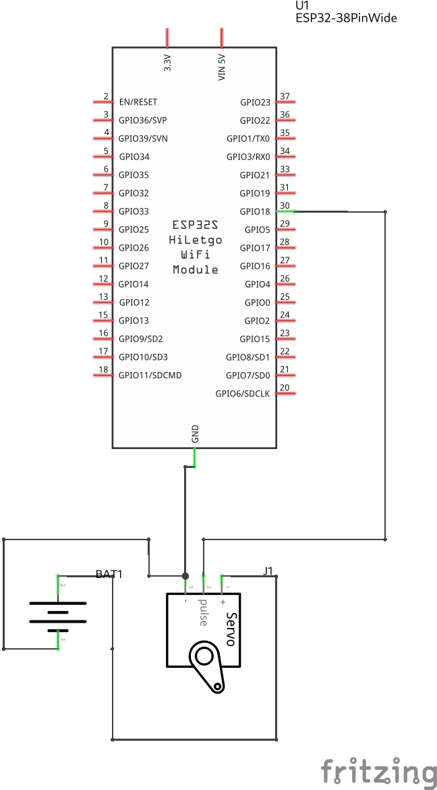

# vilhelmprytz/remote-door-lock

Remote door lock using WeMos D1 MINI ESP32 (Arduino framework), React and Flask (Python). This is a DIY IoT solution.

## Introduction

The project consists of three main components. You can find detailed information about each component and deployment instructions in their folders respectively. All three components are required for the project to work.

Firstly, the ESP32 itself. It is meant to be mounted to the lock of a door with a servo. The servo is meant to turn the lock and therefore allowing the unlocking of the door. You could modify the project to also interact with doors that have a button to unlock them (or some other electrical way of unlocking the door). The code for the ESP32 software can be found in the `esp32` folder.

Secondly, there is a backend API written in Flask (Python). The API is meant to run on a server as a cloud application. The ESP32 will poll the API to determine whether the door should be locked or unlocked. All responses from the API is JSON. While there is no authentication between the API and the ESP32, all requests that modify the state of the lock or the users who have access to it require authentication via [Google Sign-In](https://developers.google.com/identity/sign-in/web/sign-in). The code for the API software can be found in the `backend` folder.

Thirdly, the project consists of a frontend. The frontend is written in React (JavaScript) and is also meant to run on a server/static web hosting. The React application is the UI for the backend, it performs GET/POST/DELETE requests against the API. The code for the frontend software can be found in the `frontend` folder.

## Equipment

- Wemos D1 Mini32 ESP32 or similar (with WiFi!)
- Servo Motor FS5103B or similar, see [datasheet](https://www.pololu.com/file/0J1431/FS5103B-specs.pdf)

## Circuit Diagram/Schematic

Note! The battery in the diagram is not accurate. The servo motor FS5103B recommends 4.8V or 6.0V while the battery in the diagram is 3.7V. With my testing, the servo works with lower voltages as well but it is not guaranteed. Adjust the battery to run with your servo.

## Contributors ✨

Created and written by [Vilhelm Prytz](https://github.com/vilhelmprytz) - [vilhelm@prytznet.se](mailto:vilhelm@prytznet.se).
